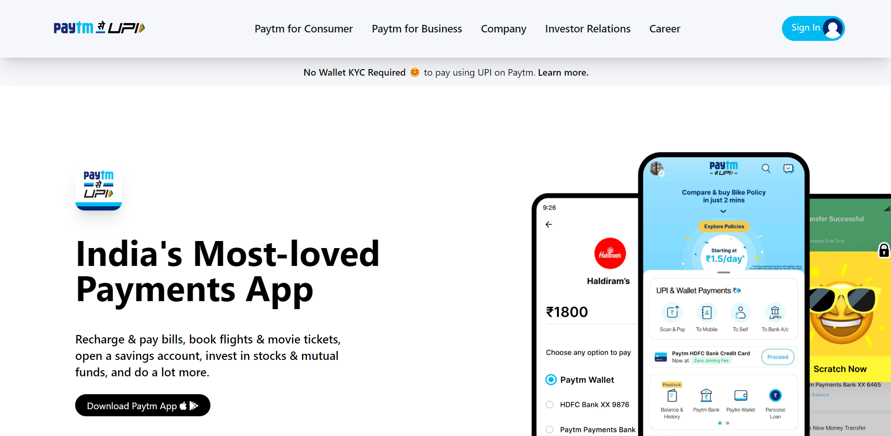

# Assignment 2

## Project 1 [Live Link](https://paytm-og.netlify.app/)

-   Skills Gained in this project
    -   Learned about Tailwind CSS.
    -   Responsive styling using Tailwind CSS

---

## Time taken to finish this project

-   Approximately 9-10 hour taken to complete this one.

#### Screenshot

